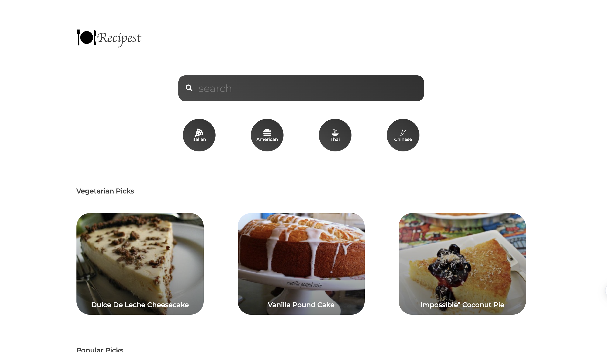
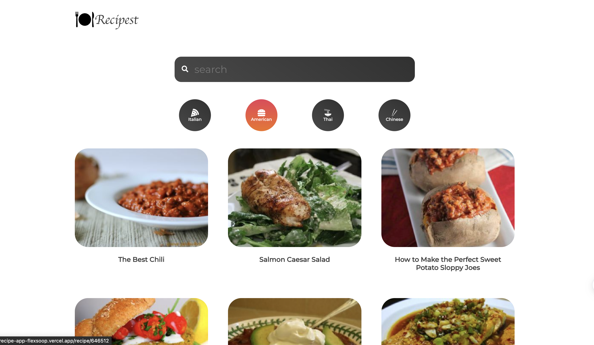
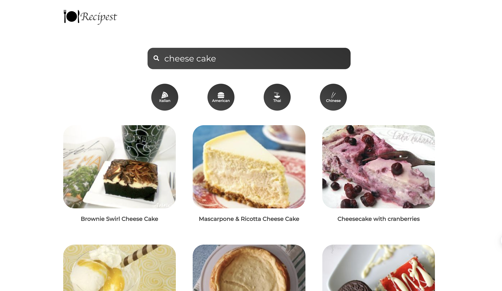
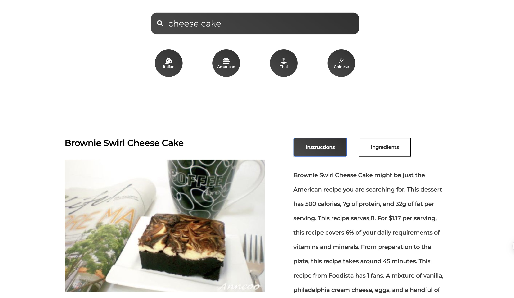

# Recipe Web App

This is a web application built with React for browsing and discovering delicious recipes. Users can search for recipes, view recipe details and instructions.

## Features

- Search for recipes by name, ingredient, or cuisine.
- View recipe details, including ingredients, instructions, and nutritional information.
- Responsive design for seamless user experience on different devices.

## Screenshot

*Recipe Web App Homepage*

*Cuisine Page*

*Search Page*

*Recipe Details Page*

## Technologies Used

- React: JavaScript library for building user interfaces.
- React Router: Routing library for handling navigation within the app.
- React-Icon: UI component library for modern and responsive UI design.
- Framer Motion: Animation library for creating interactive and smooth animations in React applications.

## Installation

1. Clone the repository to your local machine.
2. Navigate to the project directory and run `npm install` to install the dependencies.
3. Create a Firebase account and set up a new Firebase project.
4. Run `npm start` to start the development server.
5. Open a web browser and go to `http://localhost:3000` to see the app in action.

## License

This project is released under the [MIT License](LICENSE), which allows for free use, modification, and distribution. Please see the LICENSE file for more details.

## Acknowledgements

This project was inspired by a love for cooking and the desire to create a user-friendly recipe browsing experience. Special thanks to [spoonacular](https://spoonacular.com/food-api) for providing the recipe data used in this project.
